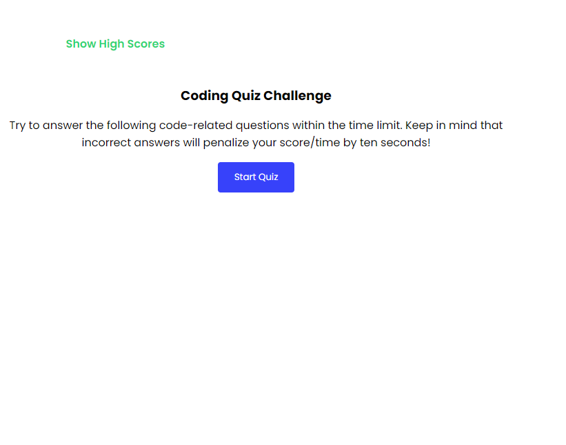

# quiz-game-JS
Want to test your knowledge of JavaScript?
Give our free coding quiz a try!
Click "Start Quiz"
Timer on top right will start to run
Total time is 100 second with 11 questions 
If the question is answered wrong, 10 seconds will be deducted to the timer
If the question is answered correctly,will add 1 score
After a question is answered,it will show on the bottom whether it is answered correctly or wrong.
if wrong will also show the correct answer. 
When all questions are answered or timer reaches 0 game is over.
By submitting your inital your score will be added to a "ShowHighScore" record.
The "ShowHighScore" link on top left will direct the user to view all current high score.
Allows to track user score.
Also it will show of saved high scores.
Also user then will have option to click on "Go Back" to start quiz again or "Clear High Scores"
to clear saved score.
GOOD LUCK.

# Installation
N/A
# Usage

# Credits
N/A

# License
https://mary90272.github.io/quiz-game-JS-/
